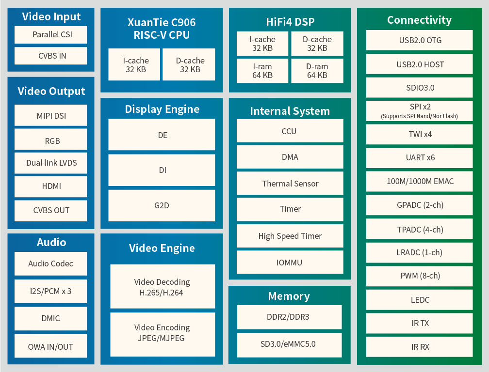

# [D1](https://github.com/SoCXin/D1)

* [Allwinner](https://www.allwinnertech.com/)：[RISC-V](https://github.com/SoCXin/RISC-V)
* [L6R6](https://github.com/SoCXin/Level)：1100 MHz
* [Xin文档](https://docs.soc.xin/D1)

## [简介](https://github.com/SoCXin/D1/wiki)

### 关键特性

* 1.1 GHz XuanTie RISC-V C906
* HiFi4 DSP
* 32 KB L1 I-cache and 32 KB L1 D-cache

### [资源收录](https://github.com/SoCXin)

* [参考资源](src/)
* [参考文档](docs/)
* [参考工程](project/)

### [选型建议](https://github.com/SoCXin)

### [探索芯世界 www.SoC.xin](http://www.SoC.Xin)
